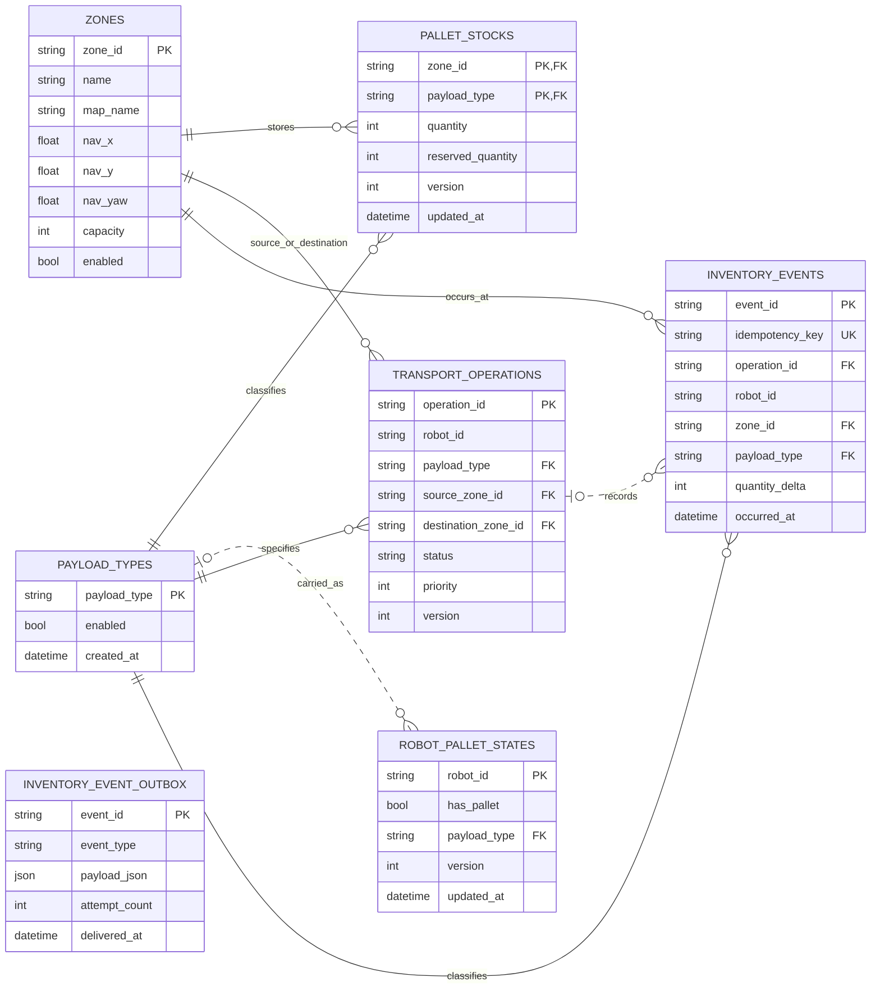
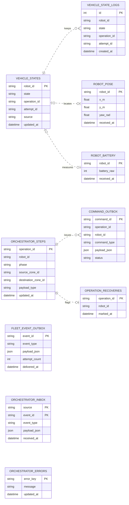

# 현재 데이터 모델 ERD

기준일: 2026-09-01
대상: 현재 저장소가 영속화하는 SQLite 데이터베이스 4개

- `operations/data/inventory.db`
- `operations/data/fleet_manager.db`
- `operations/data/orchestrator.db`
- `operations/data/fleet_telemetry.db`

이 문서는 코드의 `CREATE TABLE` 정의와 위 SQLite 파일의 실제 스키마를 함께
확인해 작성했다. ROS 2 topic, rosbag, 지도 파일, YAML 설정은 관계형 테이블이
아니므로 ERD 범위에서 제외한다.

FigJam 편집본: [현재 데이터 모델 ERD](https://www.figma.com/board/eBQLlWuLcYF0WiICVHsIio)

## 표기

- `PK`, `FK`, `UK`는 각각 기본 키, 외래 키, 유니크 키다.
- 실선(`--`)은 필수 부모를 갖는 저장소 내부 관계다.
- 점선(`..`)은 nullable FK 또는 서비스/DB 경계를 넘는 논리 참조다. 점선으로
  이어진 관계는 SQLite가 무결성을 강제하지 않을 수 있다.
- `payload_json`은 이벤트 전문을 담는 JSON 컬럼이다. JSON 내부 ID는 DB 외래
  키가 아니므로 테이블 간 선으로 표현하지 않았다.

## 1. 재고 원장 (`inventory.db`)

`pallet_stocks`는 `(zone_id, payload_type)` 복합 기본 키로 구역별 적재 수량과
예약 수량을 관리한다. `transport_operations`의 source/destination은 모두
`zones`를 참조하고, `inventory_events.operation_id`는 재고 수동 조정 시
`NULL`일 수 있다. outbox는 동일 트랜잭션에서 생성되는 전달용 이벤트지만,
전문이 JSON이므로 관계형 FK는 없다.

## 2. 차량 상태·오케스트레이션·telemetry

이 영역의 테이블들은 서로 다른 SQLite 파일에 분산되어 있다. 따라서
`vehicle_state_logs.robot_id`, telemetry의 `robot_id`,
`command_outbox.operation_id` 등은 애플리케이션이 해석하는 ID이며 DB FK가 아니다.
`orchestrator_inbox`는 `(source, event_id)` 복합 키로 이벤트 중복 수신을 막고,
`command_outbox`는 `(operation_id, command_type)` 유니크 제약으로 같은 단계의
명령 중복 생성을 막는다.

## 서비스 간 논리 참조

| 기준 컬럼 | 참조 대상 | 관계 | DB 제약 |
| --- | --- | --- | --- |
| `transport_operations.robot_id` | `vehicle_states.robot_id`, `robot_pallet_states.robot_id` | 한 운송 작업이 배정된 차량을 식별 | 없음 |
| `transport_operations.operation_id` | `vehicle_states.operation_id`, `vehicle_state_logs.operation_id` | 차량의 현재/이력 상태를 물류 작업과 상관 | 없음 |
| `transport_operations.operation_id` | `orchestrator_steps.operation_id`, `command_outbox.operation_id`, `operation_recoveries.operation_id` | 작업 단계, 명령, 복구 상태를 상관 | 없음 |
| `transport_operations.source_zone_id`, `destination_zone_id`, `payload_type` | `orchestrator_steps`의 동명 컬럼 | 오케스트레이터가 주행 목적지와 적재물 종류를 전달 | 없음 |
| `vehicle_states.robot_id` | `robot_pose.robot_id`, `robot_battery.robot_id` | 차량의 최신 상태와 최신 telemetry snapshot을 결합 | 없음 |
| 두 서비스의 `*_event_outbox.event_id` | `orchestrator_inbox.(source, event_id)` | outbox 전달 이벤트를 멱등 수신 | 애플리케이션 프로토콜 |

## 현재 모델에서 주의할 점

1. **교차 DB FK 부재**: 위 논리 참조는 SQLite가 보장하지 않는다. 삭제·재배정·복구
   시 ID 정합성은 API와 이벤트 처리에서 보장해야 한다.
2. **outbox/inbox는 JSON 경계**: `inventory_event_outbox`, `fleet_event_outbox`,
   `command_outbox`, `orchestrator_inbox`는 이벤트 전달/멱등성을 위한 테이블이며,
   일반 엔터티 관계로 해석하면 안 된다.
3. **현재 상태와 이력의 분리**: `vehicle_states`, `robot_pose`, `robot_battery`는
   최신 snapshot이고 `vehicle_state_logs`, `inventory_events`는 이력이다.
4. **향후 보완 후보**: 기존 검토 문서에서 권고한 `assignment_id`, `attempt_id`,
   location/map revision, vehicle lease는 아직 독립 엔터티/제약으로 모델링되어
   있지 않다.

## 근거와 검증

- 스키마 정의: `operations/inventory_db/app/inventory.py`, `operations/fleet_manager/app/fleet.py`,
  `operations/logistics_orchestrator/app/store.py`,
  `operations/fleet_bridge/server/ros2_ws/src/foxglove_ros_worker/foxglove_ros_worker/telemetry.py`
- 서비스 경계: `docs/2026-08-31-logistics-orchestration-review.md`
- 검증: 각 SQLite 파일의 `.schema`를 확인했고, `inventory.db`의
  `PRAGMA foreign_key_check`는 위반 행을 반환하지 않았다.
