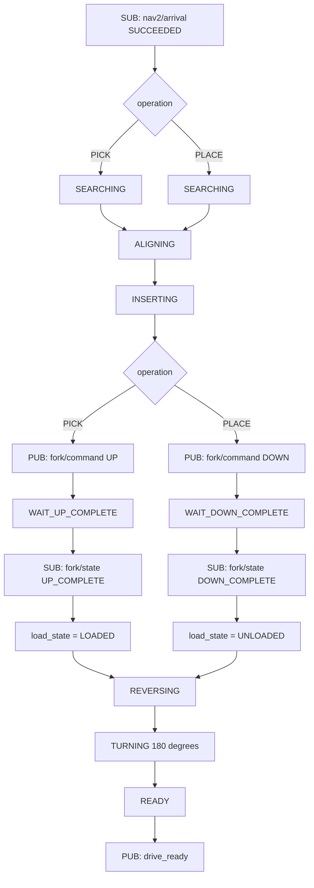

# Auto-dock 작업 흐름과 상태 머신

> **구현 상태:** 현재 저장소에서 끝까지 연결된 것은 `PICK → UP → 후진 →
> 180도 회전 → drive_ready` 흐름이다. 이 문서의 `PLACE`, `DOWN COMPLETE`,
> 위치/작업 정보가 포함된 메시지는 추가 구현이 필요한 목표 설계다.

## 목적과 담당 범위

이 문서는 Nav2가 작업 위치에 도착한 뒤 `auto_dock` 노드가 수행할 동작과
Nav2/Fork Controller 사이의 인터페이스를 정의한다. `auto_dock`의 담당 범위는
다음과 같다.

```text
Nav2 도착 수신
→ YOLO 목표 탐색
→ 횡이동 중앙 정렬
→ 포크 진입
→ Fork Controller 완료 대기
→ 직선 후진
→ 180도 회전
→ drive_ready 발행
```

목적지 선택, 빈 슬롯 선택, Nav2 경로 생성은 전체 임무 관리자와 Nav2의
담당이다. `auto_dock`은 `arrival`에 포함된 `operation`에 따라 `PICK`과
`PLACE`만 구분한다.

## 전체 흐름



## 업무 순서

### 1. Dock에서 NORMAL/FRESH 상품 픽업

```text
SUB  nav2/arrival: DOCK, PICK, NORMAL 또는 FRESH
STATE SEARCHING → ALIGNING → INSERTING
PUB  fork/command: UP
STATE WAIT_UP_COMPLETE
SUB  fork/state: UP_COMPLETE
STATE REVERSING → TURNING → READY
PUB  auto_dock/drive_ready: LOADED
```

### 2. NORMAL/FRESH 구역에 상품 하차

```text
SUB  nav2/arrival: NORMAL 또는 FRESH, PLACE
STATE SEARCHING → ALIGNING → INSERTING
PUB  fork/command: DOWN
STATE WAIT_DOWN_COMPLETE
SUB  fork/state: DOWN_COMPLETE
STATE REVERSING → TURNING → READY
PUB  auto_dock/drive_ready: UNLOADED
```

### 3. FRESH 구역에서 픽업한 뒤 Y1~Y4에 하차

```text
SUB  nav2/arrival: FRESH, PICK
STATE SEARCHING → ALIGNING → INSERTING → WAIT_UP_COMPLETE
SUB  fork/state: UP_COMPLETE
STATE REVERSING → TURNING → READY
PUB  drive_ready: LOADED

SUB  nav2/arrival: Y, Y1~Y4, PLACE
STATE SEARCHING → ALIGNING → INSERTING → WAIT_DOWN_COMPLETE
SUB  fork/state: DOWN_COMPLETE
STATE REVERSING → TURNING → READY
PUB  drive_ready: UNLOADED
```

## 현재 코드의 ROS 인터페이스

아래 형식은 현재 저장소 코드와 바로 연결된다.

| 방향 | Topic | 현재 타입과 값 | 구현 상태 |
| --- | --- | --- | --- |
| Nav2 → auto_dock | `/robot_N/nav2/arrival` | `std_msgs/String`: `arrived` 또는 `arrived spade spade` | 구현됨 |
| auto_dock → Fork | `/robot_N/auto_dock/entry_complete` | `std_msgs/Empty` | 구현됨, 항상 상승 시작 |
| Fork → auto_dock | `/robot_N/lift/up_complete` | `std_msgs/Empty` | 구현됨 |
| auto_dock → Nav2/관리자 | `/robot_N/auto_dock/drive_ready` | `std_msgs/Empty` | 구현됨 |
| auto_dock 상태 | `/robot_N/auto_dock/status` | `std_msgs/String` JSON | 구현됨 |
| auto_dock → 근거리 Nav2 | `/robot_N/nav2/approach_goal` | `geometry_msgs/PoseStamped` | 구현됨 |
| 근거리 Nav2 → auto_dock | `/robot_N/nav2/approach_result` | `std_msgs/String` JSON | 구현됨 |

현재 `arrival`에는 `location_type`, `location_id`, `operation`,
`product_type`이 없다. `entry_complete`를 받는 Fork Controller는 항상 포크를
올리며, `DOWN COMPLETE` 발행 기능도 없다. `drive_ready`에는 적재 상태가
포함되지 않는다.

## 목표 ROS 인터페이스 합의안(추가 구현 필요)

아래는 PLACE와 FRESH→Y 업무까지 지원하면서 현재 코드를 가장 적게 바꾸는
목표안이다. 별도 `logistics_msgs` 패키지는 만들지 않고 기존 `String`과
`Empty`를 유지하며, `task_id`도 사용하지 않는다.

### 최종 토픽 이름 규칙

차량 1과 2는 각각 DDS Domain 215와 216을 사용한다. 하드웨어 제어 토픽은
각 Domain 내부에서만 보이므로 기존 절대 이름을 유지하고, 업무 이벤트와 상태
토픽은 기존 프로젝트 형식인 `/robot_N/...`을 유지한다.

| 용도 | 최종 토픽 |
| --- | --- |
| Nav2 도착 업무 전달 | `/robot_N/nav2/arrival` |
| 근거리 접근 목표/결과 | `/robot_N/nav2/approach_goal`, `/robot_N/nav2/approach_result` |
| Fork 명령 | `/fork/command` |
| Fork 완료 상태 | `/robot_N/fork/state` |
| Auto-dock 진행 상태 | `/robot_N/auto_dock/status` |
| 다음 주행 허용 | `/robot_N/auto_dock/drive_ready` |
| 차량 구동/센서 | `/controller/cmd_vel`, `/scan_raw`, `/odom_raw` |

`/robot_N/auto_dock/entry_complete`와 `/robot_N/lift/up_complete`는 현재 PICK
코드와의 호환을 위한 레거시 토픽이며 새 PICK/PLACE 인터페이스에서는 사용하지
않는다.

### Nav2 → auto_dock

```text
Topic: /robot_N/nav2/arrival
Type: std_msgs/msg/String (JSON)

{"status":"SUCCEEDED","location":"NORMAL","operation":"PLACE",
 "product_type":"NORMAL","target":{"type":"AUTO_SLOT"}}
```

Nav2 담당자는 기존 `arrived spade spade` 대신 위 JSON을 발행한다. Dock PICK의
YOLO 목표 심볼이 필요할 때는
`"target":{"type":"SYMBOLS","left":"spade","right":"spade"}`를,
지정 슬롯이면 `"target":{"type":"SLOT","slot_id":"R3C3"}`를 사용한다.
현재 개발 코드는 색상별 3×3 격자를 탑뷰로 보정하고 각 셀을
`FREE/OCCUPIED/UNKNOWN`으로 판정해 우선 슬롯을 선택한다. 격자가 영상에서
잘리면 후방 LiDAR를 확인하며 시야 확보 거리만큼 후진하고, 선택 셀 중심에서
팔레트 반길이만큼 앞쪽 면을 가상 목표로 고정한다. 이후 기존
`ALIGNING → INSERTING → DOWN → REVERSING` 흐름으로 슬롯 배치를 완료한다.

### auto_dock → Fork Controller(기존 토픽 유지)

```text
Topic: /fork/command
Type: std_msgs/msg/String

UP | DOWN | STOP
```

`auto_dock`은 삽입 완료 후 PICK이면 `UP`, PLACE이면 `DOWN`을 발행한다. 현재
Fork Controller는 이미 세 명령을 처리한다.

### Fork Controller → auto_dock

```text
Topic: /robot_N/fork/state
Type: std_msgs/msg/String (JSON)

{"state":"UP_COMPLETE","error":""}
{"state":"DOWN_COMPLETE","error":""}
{"state":"FAILED","error":"lower limit timeout"}
```

Fork 담당자는 위 상태 토픽을 새로 발행해야 한다. 상단 리미트 도달은
`UP_COMPLETE`, 하단 리미트 도달은 `DOWN_COMPLETE`다.

### auto_dock → Nav2/임무 관리자

```text
Topic: /robot_N/auto_dock/drive_ready
Type: std_msgs/msg/Empty
```

Nav2/임무 관리자는 기존처럼 `drive_ready`를 다음 이동 시작 신호로 사용한다.
LOADED/UNLOADED와 선택 슬롯은 아래 `status` JSON에서 확인한다.

### auto_dock 상태 표시

```text
Topic: /robot_N/auto_dock/status
Type: std_msgs/msg/String (JSON)

{"state":"READY","operation":"PLACE","load_state":"UNLOADED",
 "result":"COMPLETE","reason":"drive_ready","slot_id":"NORMAL_R3_C1"}
```

`status`는 마지막 상태를 늦게 접속한 모니터도 읽을 수 있도록 Reliable +
Transient Local QoS를 권장한다. 명령과 완료 토픽은 Reliable QoS를 사용한다.

## 노드 내부 상태

상태와 작업 정보를 한 문자열에 모두 넣지 않고 세 변수로 분리한다.

```text
state       = 현재 실행 단계
operation   = PICK | PLACE
load_state  = LOADED | UNLOADED
```

| `state` | 의미 | 다음 전이 조건 |
| --- | --- | --- |
| `IDLE` | 초기 대기 | 성공한 `arrival` 수신 |
| `SEARCHING` | YOLO 목표 탐색 | 유효 목표 연속 검출 |
| `ALIGNING` | OpenCV 오차로 횡이동 중앙 정렬 | 중앙 오차 허용 범위 유지 |
| `INSERTING` | 정렬된 방향으로 포크 진입 | 삽입 거리 도달 |
| `WAIT_UP_COMPLETE` | Fork 상승 결과 대기 | `UP + COMPLETE` 수신 |
| `WAIT_DOWN_COMPLETE` | Fork 하강 결과 대기 | `DOWN + COMPLETE` 수신 |
| `REVERSING` | 직선 후진 | 전체 적재 형상이 회전 가능한 위치 도달 |
| `TURNING` | 180도 회전 | 목표 yaw 허용 오차 도달 |
| `READY` | 다음 Nav2 이동 가능 | 다음 `arrival` 수신 |
| `ERROR` | 실패 후 정지 | 외부 reset/새 작업 정책 |

## 구현 골격

상태 변경은 여러 콜백에서 직접 문자열을 수정하지 말고 하나의 함수로
모은다.

```python
def transition(next_state, reason):
    stop_if_required()
    state = next_state
    publish_status(state, operation, load_state, "RUNNING", reason)
```

이벤트 콜백은 현재 상태가 맞을 때만 전이한다.

```text
on_arrival(msg)
  status가 SUCCEEDED인지 검사
  state가 IDLE 또는 READY인지 검사
  PICK인데 이미 LOADED이면 실패
  PLACE인데 UNLOADED이면 실패
  operation과 목적지 정보를 저장
  SEARCHING으로 전이하고 YOLO 탐색 시작

on_yolo_detection(msg)
  SEARCHING이 아니면 무시
  목표가 안정 검출되면 ALIGNING으로 전이

alignment_tick()
  ALIGNING일 때만 횡이동 명령
  중앙 정렬이 유지되면 INSERTING으로 전이

insertion_tick()
  삽입 완료 시 fork/command를 한 번만 발행
  PICK이면 UP 발행 후 WAIT_UP_COMPLETE
  PLACE이면 DOWN 발행 후 WAIT_DOWN_COMPLETE

on_fork_result(msg)
  WAIT_UP_COMPLETE에서는 UP 결과만 허용
  WAIT_DOWN_COMPLETE에서는 DOWN 결과만 허용
  FAILED이면 즉시 정지하고 ERROR
  COMPLETE이면 load_state를 갱신하고 REVERSING

reverse_tick()
  직선 후진 중 차량과 부착 팔레트의 swept area 검사
  전체 형상이 회전 가능해진 pose를 Ready 진입점으로 저장
  안전 조건을 만족한 뒤 TURNING으로 전이

turn_tick()
  시작 yaw 기준 180도 회전
  yaw 허용 오차를 만족하면 READY로 전이
  READY 상태를 먼저 발행한 뒤 drive_ready를 한 번만 발행
```

주기 타이머는 현재 `state`에 해당하는 제어 함수 하나만 실행해야 한다.

```text
SEARCHING  → search_tick()
ALIGNING   → alignment_tick()
INSERTING  → insertion_tick()
REVERSING  → reverse_tick()
TURNING    → turn_tick()
그 외 상태 → STOP 유지
```

## 필수 방어 조건

- `fork/command`와 `drive_ready`는 상태 진입마다 한 번만 발행한다.
- `WAIT_UP_COMPLETE` 밖에서 들어온 `UP COMPLETE`는 무시한다.
- `WAIT_DOWN_COMPLETE` 밖에서 들어온 `DOWN COMPLETE`는 무시한다.
- `PICK` 시작 시 `load_state`는 반드시 `UNLOADED`여야 한다.
- `PLACE` 시작 시 `load_state`는 반드시 `LOADED`여야 한다.
- 후진 거리를 고정값으로만 판단하지 않고 차량과 팔레트 전체가 회전 가능한지 검사한다.
- 후진·회전 실패, 센서 stale, 장애물 감지 시 STOP 후 `ERROR`를 발행한다.
- 실패하거나 아직 재계산이 필요한 상태에서는 `drive_ready`를 발행하지 않는다.

## 현재 구현과 연결할 때 확인할 점

현재 `ros2_ws_src/auto_dock/auto_dock/auto_dock_node.py`에는
`/robot_N/nav2/arrival`, `/robot_N/auto_dock/entry_complete`,
`/robot_N/lift/up_complete`, `/robot_N/auto_dock/drive_ready` 흐름이 일부
구현돼 있다. 다만 기존 완료 토픽 일부는 `std_msgs/Empty`이고, 정렬 단계는
전후·횡·회전을 함께 명령하며, 후진 거리는 설정된 고정값이다. 횡이동 전용
정렬, PLACE/DOWN 완료 처리, 위 메시지 형식, 회전 가능 영역 판정을 적용할
때는 Nav2/Fork Controller 담당자와 동시에 인터페이스를 맞춰야 한다.

## 실차 수동 이벤트 패널

다른 담당 노드의 이벤트를 버튼으로 대신 발행하려면 프로젝트 루트에서 다음을
실행한다.

```bash
./tools/auto_dock_test_panel.py --vehicle 1
```

이 도구는 `/cmd_vel`을 직접 발행하지 않지만, 이벤트를 받은 `auto_dock`이
실차를 움직일 수 있다. 발행 버튼은 `실차 이벤트 발행 활성화`를 체크하기
전까지 비활성화되며 `AUTO-DOCK STOP`은 항상 사용할 수 있다.

현재 PICK 구현을 시험할 때는 `Legacy: arrived <left> <right>`와
`Legacy UP <Empty>`를 사용한다. `auto_dock`이 근거리 접근 목표를 발행하면
패널 로그의 `/nav2/approach_goal`을 확인한 뒤 `SUCCEEDED` 또는 `FAILED`로
`/nav2/approach_result`를 넣을 수 있다. Structured arrival과 `fork/state`
버튼은 목표 인터페이스가 `auto_dock`과 Fork Controller에 반영된 뒤 사용한다.
